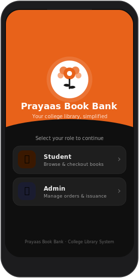
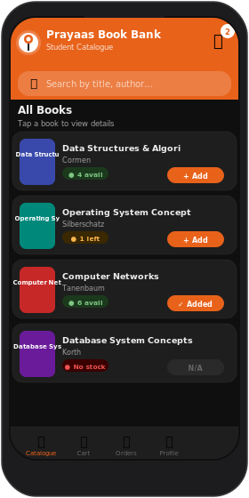
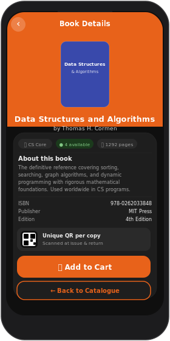
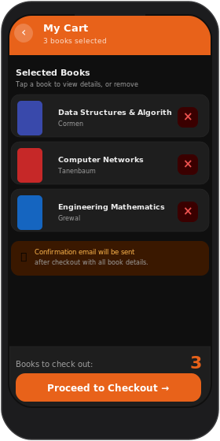
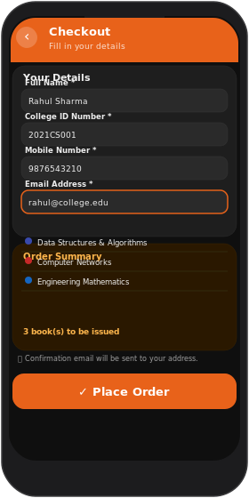
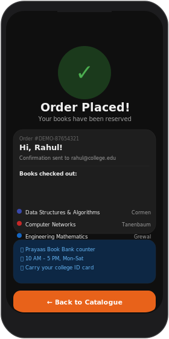
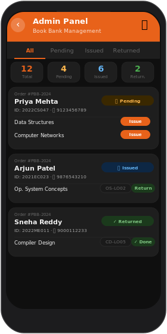
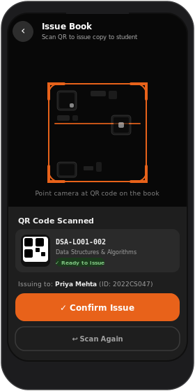
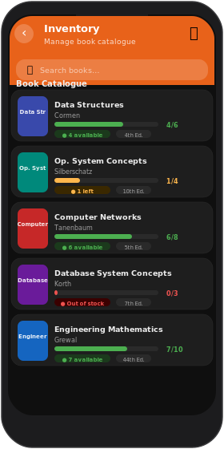

# 📚 Prayaas Book Bank

<p align="center">
  
</p>

<h3 align="center">A full-featured college book bank Android app</h3>

<p align="center">
  
  
  
  
  
</p>

<p align="center">
  Built with <strong>Kotlin · Jetpack Compose · Firebase · ML Kit Barcode Scanning · ZXing</strong>
</p>

---

## App Screenshots — Dark Mode

### Student Flow

<table>
  <tr>
    <td align="center" width="200">
      <br/>
      <sub><b>Role Selection</b></sub><br/>
      <sub>Student or Admin entry point</sub>
    </td>
    <td align="center" width="200">
      <br/>
      <sub><b>Book Catalogue</b></sub><br/>
      <sub>Search, browse, availability badges</sub>
    </td>
    <td align="center" width="200">
      <br/>
      <sub><b>Book Detail</b></sub><br/>
      <sub>Cover, summary, ISBN, QR info</sub>
    </td>
  </tr>
  <tr>
    <td align="center" width="200">
      <br/>
      <sub><b>Cart</b></sub><br/>
      <sub>Review books, remove, proceed</sub>
    </td>
    <td align="center" width="200">
      <br/>
      <sub><b>Checkout</b></sub><br/>
      <sub>Name, ID, mobile, email + validation</sub>
    </td>
    <td align="center" width="200">
      <br/>
      <sub><b>Order Success</b></sub><br/>
      <sub>Confirmation + pickup instructions</sub>
    </td>
  </tr>
</table>

### Admin Flow

<table>
  <tr>
    <td align="center" width="200">
      <br/>
      <sub><b>Admin Orders</b></sub><br/>
      <sub>Stats, filter tabs, Issue / Return</sub>
    </td>
    <td align="center" width="200">
      <br/>
      <sub><b>QR Scanner</b></sub><br/>
      <sub>ML Kit camera, confirm issue / return</sub>
    </td>
    <td align="center" width="200">
      <br/>
      <sub><b>Inventory</b></sub><br/>
      <sub>Stock levels with progress bars</sub>
    </td>
  </tr>
</table>

---

## Quick Overview

| | Student | Admin |
|---|---|---|
| **Entry** | Role selection → catalogue | Role selection → orders dashboard |
| **Core action** | Browse → cart → checkout | Scan QR → issue or receive return |
| **Offline** | 10 sample books preloaded | 4 demo orders preloaded |
| **Email** | Confirmation sent on order | — |
| **QR** | View QR info per book | Scan physical copy to verify identity |
| **Availability** | Live stock count, colour-coded | Progress bar per book in Inventory |

---

## Features

### Student Flow
- **Role selection** — Student or Admin entry point
- **Book catalogue** — Browse with real-time availability; search by title, author, or subject
- **Book detail** — Cover image, summary, ISBN, edition, pages, QR code info
- **Cart** — Add/remove books; tap any item to jump back to its detail view
- **Checkout** — Name, College ID, mobile, email with inline field validation
- **Email confirmation** — Auto-sent via Firebase Functions + Nodemailer on every order
- **Order success** — Order ID, books list, colour-coded pickup instructions card

### Admin Flow
- **Orders dashboard** — Stat cards (total / pending / issued / returned); filter by status tab
- **Issue books** — Tap _Issue_ → scan book QR → confirm → Firestore updated, stock decremented
- **Return books** — Tap _Return_ → scan QR → verify same copy that was issued → stock restored
- **Inventory** — All books with colour-coded availability progress bars
- **QR Generator** — Generate printable ZXing `Bitmap` QR codes for each physical copy; share as PNG

### QR Copy System
- Every physical copy has a **unique QR** encoding `{"copyId","bookId","title","author"}` as JSON
- **ML Kit Barcode Scanning** — on-device, works without internet
- Issue flow validates the scanned QR belongs to the correct ordered book
- Return flow validates the returned copy matches the one originally issued to that student
- `QrCodeGenerator.kt` produces printable `Bitmap` images via ZXing

---

## Tech Stack

| Layer | Technology |
|---|---|
| Language | Kotlin 1.9.20 |
| UI | Jetpack Compose + Material 3 |
| Navigation | Navigation Compose 2.7.6 |
| State management | ViewModel + StateFlow |
| Database | Firebase Firestore (real-time listeners) |
| Email | Firebase Cloud Functions + Nodemailer (Gmail SMTP) |
| QR Scanning | ML Kit Barcode Scanning + CameraX 1.3 |
| QR Generation | ZXing `QRCodeWriter` → `Bitmap` |
| Image loading | Coil 2.5 |
| Offline / demo | `LocalDataSource.kt` — 10 books + 4 orders, zero Firebase needed |
| Permissions | Accompanist Permissions |

---

## Project Structure

```
PrayaasBookBank/
├── app/src/main/java/com/prayaas/bookbank/
│   ├── MainActivity.kt                   ← NavHost wiring all 10 screens
│   ├── ui/
│   │   ├── Navigation.kt                 ← Screen sealed class + routes
│   │   ├── theme/Theme.kt                ← Brand colors, typography, shapes
│   │   ├── components/Components.kt      ← Shared composables + contrast helper
│   │   └── screens/
│   │       ├── RoleSelectScreen.kt
│   │       ├── CatalogueScreen.kt
│   │       ├── BookDetailScreen.kt
│   │       ├── CartScreen.kt
│   │       ├── CheckoutScreen.kt         ← + OrderSuccessScreen
│   │       ├── AdminOrdersScreen.kt
│   │       ├── AdminInventoryScreen.kt
│   │       ├── QrScannerScreen.kt        ← CameraX + ML Kit
│   │       └── QrGeneratorScreen.kt      ← ZXing bitmap grid + share
│   ├── data/
│   │   ├── model/Models.kt               ← Book, Order, BookCopy, QrPayload
│   │   └── repository/
│   │       ├── BookRepository.kt         ← All Firestore operations
│   │       └── LocalDataSource.kt        ← 10 books + 4 orders, offline fallback
│   ├── viewmodel/ViewModels.kt           ← 4 ViewModels with offline fallback
│   └── utils/
│       ├── QrCodeGenerator.kt            ← ZXing generate + parse
│       └── EmailHelper.kt                ← Firebase Functions wrapper
├── firebase-functions/
│   ├── index.js                          ← sendEmail callable + onOrderCreated trigger
│   └── package.json
├── seed/seed.js                          ← One-time Firestore population script
├── firestore.rules                       ← Security rules (admin custom claim)
├── firestore.indexes.json                ← Composite indexes
└── screenshots/                          ← Dark-mode SVG mockups
    ├── 01_role_select.svg
    ├── 02_catalogue.svg
    ├── 03_book_detail.svg
    ├── 04_cart.svg
    ├── 05_checkout.svg
    ├── 06_order_success.svg
    ├── 07_admin_orders.svg
    ├── 08_qr_scanner.svg
    └── 09_inventory.svg
```

---

## Firestore Data Model

### `books/` collection
```json
{
  "title": "Data Structures and Algorithms",
  "author": "Thomas H. Cormen",
  "isbn": "978-0262033848",
  "subject": "Computer Science",
  "summary": "...",
  "totalCopies": 6,
  "availableCopies": 4,
  "edition": "4th Edition",
  "pages": 1292,
  "publisher": "MIT Press"
}
```

### `bookCopies/` collection
```json
{
  "bookId": "firestore_doc_id",
  "qrData": "DSA-ABC1-001",
  "isAvailable": true,
  "currentOrderId": null
}
```

### `orders/` collection
```json
{
  "studentName": "Rahul Sharma",
  "studentId": "2021CS001",
  "mobileNumber": "9876543210",
  "email": "rahul@college.edu",
  "status": "PENDING",
  "books": [
    {
      "bookId": "abc123",
      "bookTitle": "Data Structures and Algorithms",
      "copyId": null,
      "isReturned": false
    }
  ]
}
```

### Order status lifecycle

```
PENDING ──► PARTIAL (some books scanned) ──► ISSUED (all books scanned out)
                                                        │
                                                        ▼
                                               RETURNED (all copies back)
```

---

## Setup

### 1. Create Firebase project

```
https://console.firebase.google.com
 → Add Android app → package: com.prayaas.bookbank
 → Download google-services.json → place in app/google-services.json
 → Enable: Firestore, Authentication, Storage, Functions (Blaze plan)
```

### 2. Deploy Firestore rules and indexes

```bash
firebase deploy --only firestore:rules,firestore:indexes
```

### 3. Seed sample data

```bash
cd seed
npm install firebase-admin
# Download service account key → Firebase Console → Project Settings → Service Accounts
# Save as seed/serviceAccountKey.json
node seed.js
```

### 4. Deploy Cloud Functions (email)

```bash
cd firebase-functions && npm install
firebase deploy --only functions
firebase functions:secrets:set GMAIL_USER   # your Gmail address
firebase functions:secrets:set GMAIL_PASS   # Gmail App Password
```

> For production, replace Nodemailer with [SendGrid](https://sendgrid.com/) for better deliverability.

### 5. Open in Android Studio

```
File → Open → select the PrayaasBookBank/ folder
```

Gradle syncs automatically. The app launches with **10 sample books and 4 demo orders** — no Firebase needed to explore the full UI.

---

## QR Code Printing

Open the in-app generator: **Admin → Inventory → ⬛ icon (top bar)**

Or generate programmatically:

```kotlin
val bitmap = QrCodeGenerator.generateQrBitmap(
    copyId = "DSA-ABC1-001",
    bookId = "firestore_document_id",
    title  = "Data Structures and Algorithms",
    author = "Thomas H. Cormen",
    size   = 512   // pixels
)
// QR payload: {"copyId":"DSA-ABC1-001","bookId":"...","title":"...","author":"..."}
```

---

## License

Built for **Prayaas** — College Book Bank System.  
Logo and branding © Prayaas. All rights reserved.
